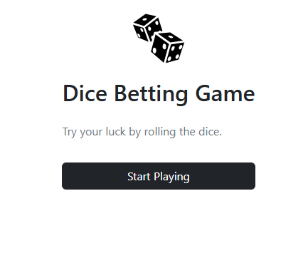
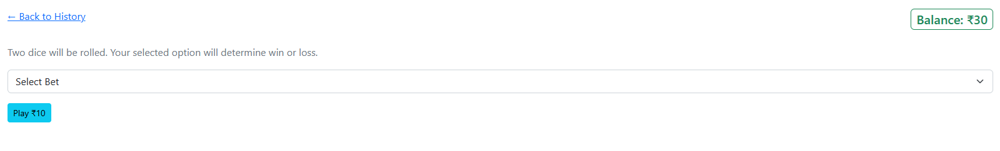
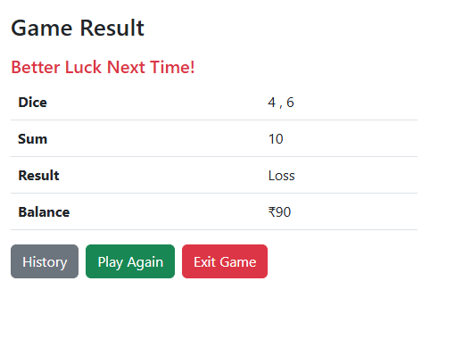

# dice-game (Laravel + Blade)
Dice Betting Game

## Overview

**Game Details**
- The user starts the game with ₹100.
- At the beginning of every round, the user must place a bet of ₹10.
- If the user’s balance drops below ₹10, the game should end.

**Betting Options**
In each round, the user can choose one of the following options:
- Below 7 – if the sum of dice is less than 7
- Lucky 7 – if the sum of dice is exactly 7
- Above 7 – if the sum of dice is greater than 7

**Game Rules**
- Two standard six-sided dice are rolled.
- The sum of the dice is calculated.

**Winning Criteria**
- If the user bets Below 7 and the dice sum is less than 7, the user wins ₹20.
- If the user bets Above 7 and the dice sum is greater than 7, the user wins ₹20.
- If the user bets Lucky 7 and the dice sum is exactly 7, the user wins ₹30.
- In all other cases, the user loses the ₹10 bet.

**Game Flow**
- Deduct ₹10 from the user’s balance at the start of each round.
- Take the user’s betting choice.
- Roll the dice and calculate the sum.
- Determine whether the user wins or loses.

**Display:**

- Dice values
- Dice sum
- Result (Win/Loss)
- Updated balance

Ask the user whether they want to continue playing.

**End Conditions**
- The game ends when the user's balance is less than ₹10, or
- The user chooses to exit the game.

---

## Screenshots

**Welcome Page (/)**

**Game History/Logs**
.png)

**Game Play**

**Game Result**
